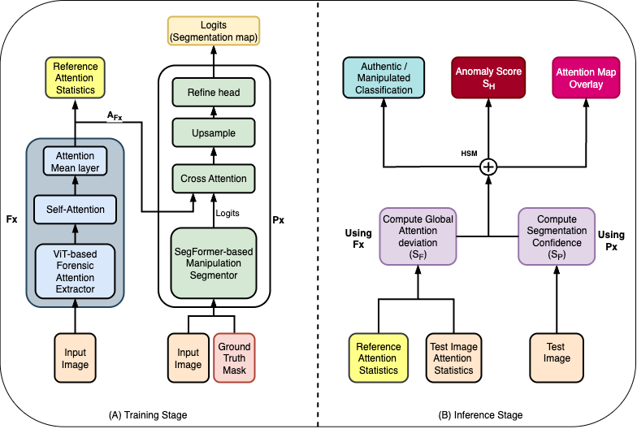
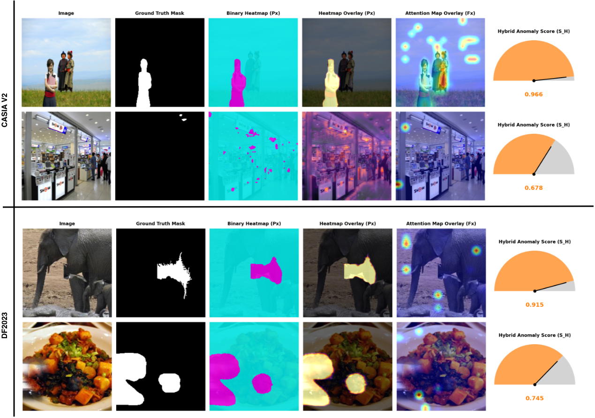

# VAAS: Vision-Attention Anomaly Scoring for Image Manipulation Detection in Digital Forensics

## Abstract

Recent advances in AI-driven image generation have introduced new challenges for verifying the authenticity of digital evidence
in forensic investigations. Modern generative models can produce visually consistent forgeries that evade traditional detectors
based on pixel or compression artefacts. Most existing approaches also lack an explicit measure of anomaly intensity, which
limits their ability to quantify the severity of manipulation. This paper introduces Vision-Attention Anomaly Scoring (VAAS),
a novel dual-module framework that integrates global attention-based anomaly estimation using Vision Transformers (ViT) with
patch-level self-consistency scoring derived from SegFormer embeddings. The hybrid formulation provides a continuous and
interpretable anomaly score that reflects both the location and degree of manipulation. Evaluations on the DF2023 and CASIA v2.0
datasets demonstrate that VAAS achieves competitive F1 and IoU performance while enhancing visual explainability through
attention-guided anomaly maps. The framework bridges quantitative detection with human-understandable reasoning, supporting
transparent and reliable image integrity assessment. 

**This repository contains the experimental training and evaluation code used in the VAAS study.**

## Model Framework



## Inference Sample Visuals



## Read the research paper

- [Journal version](to appear)

## Using model: Huggingface Model Card for Quick Inference

- [Checkout](to be released after publication)

## Dataset

### CASIA v2.0

CASIA by Dong is a foundational benchmark for evaluating splicing and compositing detection methods. It contains approximately 12,614 images, including 7,491 authentic and 5,123 tampered samples, each with a corresponding ground-truth mask.

- [Casia v2.0 dataset link](https://www.kaggle.com/datasets/divg07/casia-20-image-tampering-detection-dataset)

### DF2023

DF2023 by Fischinger and Boyer was designed to benchmark forensic methods against AI-generated and hybrid manipulations. The full dataset contains approximately one million forged images distributed across four manipulation types: 100K removal, 200K enhancement, 300K copy–move, and 400K splicing operations.

- [DF2023 dataset link](https://www.kaggle.com/datasets/hiwotyirga/the-digital-forensics-2023-dataset-df2023)

## Dependencies

`uv sync`

- *PyTorch with CUDA support recommended*
- *Python 3.10+*

## Training and Evaluating CASIA

```bash
  python train.py \
  --dataset CASIA2 \
  --dataset-root "<Absolute path to dataset root directory>/CASIA2/CASIA2" \
  --exp-id "CASIA_segformer_v3" \
  --epochs 50 \
  --lr 1e-4 \
  --loss-type focal \
  --pos-weight 15 \
  --dice-weight 0.7 \
  --focal-alpha 0.25 \
  --focal-gamma 2.5 \
  --alpha 0.3
```


## Inference

```bash
  python infer.py \
  --dataset-root "<Absolute path to dataset root directory>/CASIA2/CASIA2" \
  --dataset CASIA2 \
  --checkpoint-dir "<Absolute path to checkpoint>" \
  --output-dir "inference_visuals" \
  --num-samples 20 \
  --vis-mode both \
  --alpha 0.5
```


## Threshold sweep

```bash
  python threshold_sweep.py \
  --dataset-root "<Absolute path to dataset root directory>/CASIA2/CASIA2" \
  --checkpoint-dir "Absolute path to checkpoint>" \
  --max-samples 300
```


## Training and Evaluating DF2023

```bash
  python train.py \
  --dataset DF2023 \
  --dataset-root "<Absolute path to dataset root directory>/DF2023_V15" \
  --exp-id "DF2023_segformer_v3" \
  --epochs 50 \
  --lr 1e-4 \
  --loss-type focal \
  --pos-weight 15 \
  --dice-weight 0.7 \
  --focal-alpha 0.25 \
  --focal-gamma 2.5 \
  --alpha 0.3
```


## Inference

```bash
  python infer.py \
  --dataset-root "<Absolute path to dataset root directory>/DF2023_V15" \
  --dataset DF2023 \
  --checkpoint-dir "<Absolute path to checkpoint>" \
  --output-dir "inference_visuals_new" \
  --num-samples 20 \
  --vis-mode both \
  --alpha 0.5
```


## Threshold sweep

```bash
  python threshold_sweep.py \
  --dataset-root "<Absolute path to dataset root directory>/DF2023_V15" \
  --checkpoint-dir "<Absolute path to checkpoint>" \
  --max-samples 300
```

## Citation

To cite this work, please use the following BibTeX entry once available:

<!-- ```python
@ARTICLE{,
  author={},
  journal={}, 
  title={}, 
  year={},
  volume={},
  number={},
  pages={},
  keywords={I},
  doi={}}
``` -->
